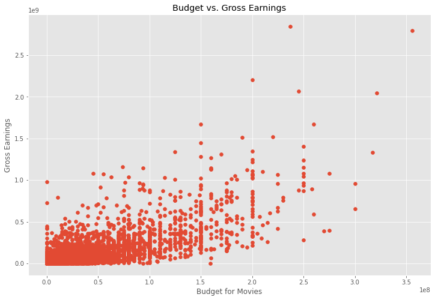
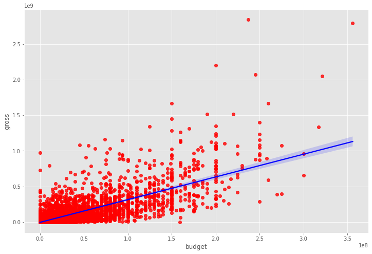
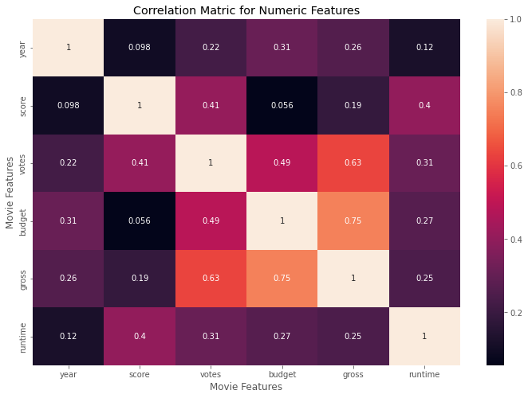
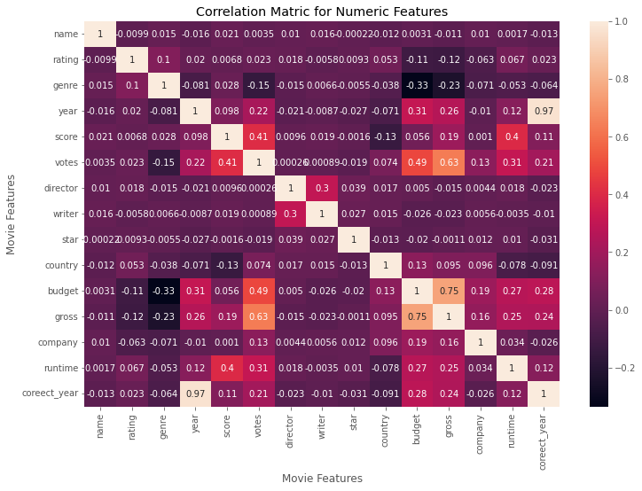

# Correlation Analysis of different factors affecting Movie revenue


## Dataset: 

This project utilizes data from the **Kaggle Movie Industry Dataset**.

[Link movies to Dataset](https://www.kaggle.com/danielgrijalvas/movies)

## Data Cleaning:

The following steps were carried out as part of the project: 

* Checking for Missing Values:  
    The Dataset had a few missing values. Missing values were replaced.

* Data Type correction
* The exact date and year was extracted to a python **datetime** format from the ```'released'``` column.  
    In order to achieve this, the function ```parse_date()``` was applied to the DataFrame. 

* Duplicate Values were Dropped.

## Correlation Study: 

### Correlation Between Budget and Gross Earnings:

A scatter plot was performed between Budget and Gross Earnings:



A regression plot on the data shows a positive correlation between the two:



### Pearson Correlation Matrix:

Pearson correlation calculated between different factors:

|      |year  |score   |votes	     |budget     |	gross     | runtime  |
|------|--------|------------|-----------|------------|----------|-----------|
|year|1.000000|	0.097995|	0.222945|	0.309212|	0.261900|	0.120811|
|score|	0.097995|	1.000000|	0.409182|	0.055665|	0.186392|	0.399451|
|votes|	0.222945|	0.409182|	1.000000|	0.486862|	0.632834|	0.309212|
|budget|	0.309212|	0.055665|	0.486862|	1.000000|	0.750157|	0.269510
|gross|	0.261900|	0.186392|	0.632834|	0.750157|	1.000000|	0.245235|
|runtime|	0.120811|	0.399451|	0.309212|	0.269510|	0.245235|	1.000000|

As we can see, from the Pearson Correlation Matrix also, there is a positive correlation between **Budget** and **Gross Earnings**

### Visualization of Correlation Matrix

The correlation matrix is visualized as follows: 



### Detailed Correlation Matrix

A detailed correlation matrix was calculated with more variables: 



A high correlation can be seen between the following values: 

||||
|------|---------------|-----------------|
|budget|        gross|           0.750157|
|gross|         budget|          0.750157|
||votes|           0.632834|
|votes|         gross|           0.632834|


## Conclusion:

```'votes'``` and ```'budget'``` have the highest correlation to gross earnings

Company has low correlation with gross earnings. 

You can find the full Analysis in the notebook *Movie Correlation Project in Python.ipynb*
